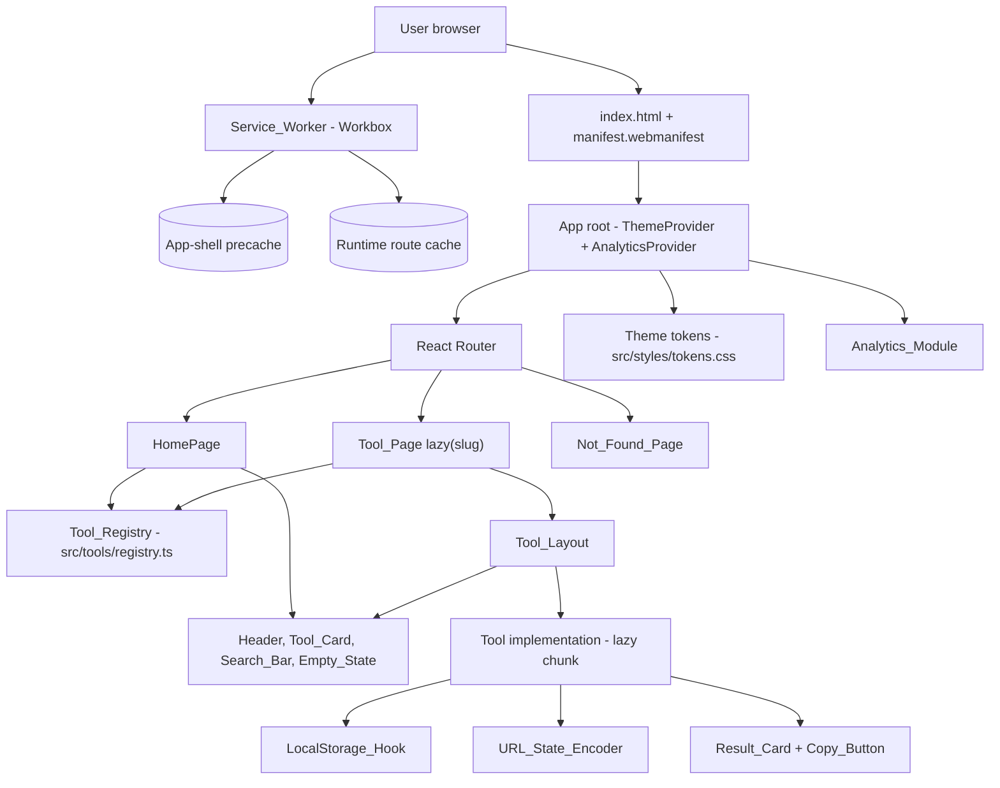

# Design Document

## Overview

Dogu_Platform is a static React + Vite Progressive Web App that hosts a catalog of tiny daily-use web tools. This design covers only the platform foundation: the Tool_Registry, Router, Homepage, Not_Found_Page, shared layout and interaction components (Header, Tool_Layout, Tool_Card, Search_Bar, Copy_Button, Result_Card, Empty_State), the Theme_System, the LocalStorage_Hook and URL_State_Encoder utilities, the PWA shell (Manifest + Service_Worker + offline fallback), the Plausible Analytics_Module, mobile-first responsive layout, and the performance budgets that constrain the build. Individual tools are out of scope and will register against this platform in their own specs.

The platform ships as static HTML, JS, and CSS with no server. Tool implementations are lazy-loaded on demand, so the initial bundle stays under the 150 KB gzipped budget. State that needs to survive a reload is held in localStorage under the `dogu:` namespace; state that needs to be shared via a link is encoded into the URL hash with a base64url JSON encoder. Both utilities are pure modules so they can be exhaustively property-tested.

The product feel is "Japanese utility minimalism": dark, calm, fast, mobile-first. The Theme_System owns every color, radius, type, and motion timing as a design token, applied through Tailwind on top of CSS custom properties so that the dark theme paints on first frame with no flash.

### Key design decisions

- **Static SPA with a host-level 404 fallback.** Requirement 2.4 forbids the host from returning 404 on direct navigations to `/tools/{slug}`. The platform uses React Router's `BrowserRouter` plus per-host fallback configuration (`404.html` redirect for GitHub Pages, `_redirects` for Netlify/Cloudflare Pages, `vercel.json` rewrite for Vercel). This keeps URLs clean (`/tools/team-splitter`, not `/#/tools/team-splitter`) while staying purely static.
- **Single source of truth for tools.** The Tool_Registry is a typed array literal in `src/tools/registry.ts`. Adding a tool means editing exactly one file plus dropping its implementation under `src/tools/{slug}/`. Validation runs at build time so a malformed registry breaks the build, not production.
- **Pure utilities, impure adapters.** The URL_State_Encoder and the JSON serialization core of the LocalStorage_Hook are pure functions, isolated from React and from the `localStorage`/`window.location` globals. The hook and a thin URL adapter wrap them. This makes the testable surface large and the integration surface small.
- **Tokens, not hardcoded styles.** Tailwind's `theme.extend` reads the same color, radius, and timing tokens that CSS custom properties expose, so tokens are the only place those values appear.
- **Reduced motion is a first-class state.** All transitions read `prefers-reduced-motion` through a single `useReducedMotion` boundary; components do not implement their own opt-outs.

## Architecture

### Stack

- **React 18** with TypeScript for the UI tree.
- **Vite 5** as the build tool. Vite's `import()` boundary is the lazy-load boundary for tool chunks. `vite-plugin-pwa` (Workbox under the hood) generates the Service_Worker and manages the precache manifest.
- **React Router v6** with `BrowserRouter`, `Routes`, and `React.lazy` per Tool_Page.
- **Tailwind CSS** for styling, with `theme.extend` driven by CSS custom properties from the design tokens file.
- **Framer Motion** for the small set of motion transitions (button/card hover, page enter), gated by `useReducedMotion`.
- **Lucide React** for icons.
- **Plausible Analytics** loaded as a lightweight `<script>` tag in `index.html`, with manual page-view dispatching on client-side route changes.
- **Vitest + React Testing Library** for unit and component tests.
- **fast-check** for property-based tests (TypeScript native, integrates with Vitest).
- **Playwright** for the small offline/PWA smoke suite.
- **Lighthouse CI** for the performance budgets (LCP, bundle size).

### High-level structure



### Routing model

| Path                      | Component        | Loaded                                       |
| ------------------------- | ---------------- | -------------------------------------------- |
| `/`                       | `HomePage`       | Eager (in initial bundle)                    |
| `/tools/{slug}`           | `ToolPage`       | `ToolPage` shell eager; tool impl lazy chunk |
| Anything else             | `NotFoundPage`   | Eager (in initial bundle)                    |

Slug validation in the route is enforced two ways. First, the React Router route is `/tools/:slug` and the `ToolPage` component looks the slug up in the registry; an unknown or malformed slug renders the Not_Found_Page (Requirement 2.3). Second, at build time the Tool_Registry rejects any malformed slug (Requirement 1.6). The slug regex is `^[a-z0-9](?:[a-z0-9-]{0,62}[a-z0-9])?$` — 1–64 chars, lowercase alphanumeric and hyphen, no leading or trailing hyphen, single source of truth in `src/tools/registry.ts`.

### Static hosting and SPA fallback

`BrowserRouter` requires the host to serve `index.html` for any unknown path so the client router can take over. Without it, a reload on `/tools/team-splitter` returns a host 404 and breaks Requirement 2.4. The platform supplies one fallback configuration per supported host in `public/`:

- **GitHub Pages**: a `public/404.html` that contains a one-line script storing `location.pathname + location.search` in `sessionStorage` and redirecting to `/`. `index.html` reads `sessionStorage` on boot and replays the path with `history.replaceState`. (This is the well-known SPA-on-Pages workaround.)
- **Netlify / Cloudflare Pages**: `public/_redirects` containing `/*  /index.html  200`.
- **Vercel**: `vercel.json` with a single `rewrites` entry mapping `(/.*)` → `/index.html`.

Only one fallback is active per deployment — the rest are inert files. The `404.html` redirect is also what makes the offline fallback for unvisited tools work (see PWA Shell below).

### PWA shell

The Service_Worker is generated by `vite-plugin-pwa` in `injectManifest` mode so we can hand-write the routing logic while still getting Workbox's precache generation and update lifecycle.

- **Precache** the app shell: `index.html`, the entry JS chunk, the vendor chunk, the platform CSS, the logo SVG, and `manifest.webmanifest`. (Requirement 10.2.)
- **Runtime cache** Tool_Page chunks with a `StaleWhileRevalidate` strategy keyed by URL. The chunk for a Tool_Page becomes available offline after one online visit (Requirement 10.4).
- **Navigation handler**: for any navigation request, try the precached shell; if the URL is `/tools/{slug}` and the slug's chunk is not in the runtime cache, fall back to a precached `offline.html` page that renders the same layout, an "unavailable offline" message, and a link to `/` (Requirement 10.5).
- **Update lifecycle**: `registerSW({ immediate: true })` triggers a background fetch within 60 seconds of the next page load (Requirement 10.6). New versions activate on the next full navigation (Requirement 10.7); failed background fetches retain the prior cache (Requirement 10.8). No "update available" toast in the MVP — the next reload picks it up.
- **Failure mode**: if `navigator.serviceWorker.register` rejects, the platform logs a console warning and continues with direct network requests (Requirement 10.3). The Service_Worker is never on the critical path for first paint.

### Analytics

Plausible is loaded via a `<script defer data-domain="dogu.app" src="https://plausible.io/js/script.js">` tag in `index.html`, gated by `import.meta.env.PROD` so dev and preview do not emit events (Requirement 11.5). The script's default behavior records the initial page view; client-side route changes are reported by an `AnalyticsProvider` that listens to React Router's `useLocation` and calls `window.plausible('pageview')`. If `window.plausible` is undefined (script blocked or failed to load), the call is a no-op (Requirement 11.6).

No cookies, no PII, no user identifiers (Requirements 11.3, 11.4) — Plausible's design takes care of this; we do not pass `props` containing user data.

### Performance strategy

- **Initial bundle ≤ 150 KB gzipped** (Requirement 14.3). Vite splits the build into `index.[hash].js` (app entry + HomePage + Not_Found_Page + shared components + hooks + utils), `vendor.[hash].js` (React, React Router, Framer Motion core), and one chunk per tool under `assets/tools/{slug}.[hash].js`. The performance budget is enforced with a `rollup-plugin-visualizer` size check in CI.
- **Lazy tool chunks** (Requirement 14.4). Each registry entry's `component` field is a `() => import('./tools/{slug}')` factory. `React.lazy` consumes that factory inside `ToolPage`.
- **Route-level Suspense** with a 200 ms-delayed loading indicator (Requirement 14.6) and a 10-second fetch timeout that surfaces an error UI with a retry button (Requirement 14.5). The timeout is implemented as `Promise.race` between the dynamic import and a `setTimeout` reject.
- **LCP target**: dark theme painted from inline CSS variables in `<head>` (Requirement 5.7), Geist font preloaded with `font-display: swap`, hero text static and inline in the homepage HTML so the first contentful element does not wait on JS.

### Theme tokens

A single `src/styles/tokens.css` defines CSS custom properties at `:root`:

```css
:root {
  --color-bg: #09090B;
  --color-surface: #18181B;
  --color-accent: #2563EB;
  --color-text: #FAFAFA;
  --color-text-secondary: #A1A1AA;

  --radius-card: 1rem;     /* rounded-2xl */
  --radius-button: 0.75rem; /* rounded-xl */

  --motion-duration-fast: 200ms;
  --motion-easing: cubic-bezier(0, 0, 0.2, 1); /* ease-out */

  --font-sans: 'Geist', 'Inter', system-ui, sans-serif;
}
```

`tailwind.config.ts` reads these via `theme.extend.colors`, `theme.extend.borderRadius`, `theme.extend.fontFamily`, and `theme.extend.transitionDuration`, so any Tailwind class (`bg-surface`, `rounded-card`, etc.) resolves to the same token. Updating a token in `tokens.css` propagates through every component without code changes (Requirement 5.4). The `<html>` element sets `class="dark"` and `style="background:#09090B;color:#FAFAFA"` inline so first paint is dark (Requirement 5.7).

A `MotionProvider` wraps the tree and exposes the result of Framer Motion's `useReducedMotion`. Components like `Tool_Card` use a `transition` value of `prefersReducedMotion ? { duration: 0 } : { duration: 0.2, ease: 'easeOut' }` (Requirements 5.5, 5.6).

## Components and Interfaces

### `Tool_Registry` — `src/tools/registry.ts`

```ts
export const SLUG_PATTERN = /^[a-z0-9](?:[a-z0-9-]{0,62}[a-z0-9])?$/;

export type ToolCategory =
  | 'random'        // Team Splitter, Spin Wheel, Random Picker
  | 'calculator'    // Split Bill
  | 'generator'     // QR Generator
  | 'converter'
  | 'utility';

export interface ToolMetadata {
  slug: string;                                  // matches SLUG_PATTERN, 1–64 chars
  name: string;                                  // 1–60 chars, display name
  description: string;                           // 1–160 chars, short description
  category: ToolCategory;
  icon: LucideIcon;                              // icon reference
  popular: boolean;
  component: () => Promise<{ default: ComponentType }>; // lazy component reference
}

/** Read-only, lexicographically slug-sorted, build-time-validated. */
export const tools: ReadonlyArray<ToolMetadata>;

/** Throws a descriptive error if any entry is invalid or any slug is duplicated. */
export function validateRegistry(entries: ToolMetadata[]): void;

/** Pure lookup. Returns undefined for unknown slugs. */
export function findTool(slug: string): ToolMetadata | undefined;
```

`validateRegistry` runs at module load (so a bad registry throws on the first import — and Vite's build fails). It also runs as a Vitest unit + property test against the actual array.

### `Router` — `src/App.tsx` + `src/pages/`

```tsx
<BrowserRouter>
  <ThemeProvider>
    <MotionProvider>
      <AnalyticsProvider>
        <Routes>
          <Route path="/" element={<HomePage />} />
          <Route path="/tools/:slug" element={<ToolPage />} />
          <Route path="*" element={<NotFoundPage />} />
        </Routes>
      </AnalyticsProvider>
    </MotionProvider>
  </ThemeProvider>
</BrowserRouter>
```

`ToolPage` resolves the slug:

```tsx
function ToolPage() {
  const { slug = '' } = useParams();
  const tool = useMemo(() => findTool(slug), [slug]);
  if (!tool) return <NotFoundPage />;
  const Lazy = useMemo(() => React.lazy(withTimeout(tool.component, 10_000)), [tool]);
  return (
    <Tool_Layout title={tool.name}>
      <Suspense fallback={<DelayedSpinner delay={200} />}>
        <ErrorBoundary fallback={<ChunkLoadError onRetry={...} />}>
          <Lazy />
        </ErrorBoundary>
      </Suspense>
    </Tool_Layout>
  );
}
```

`withTimeout` races the dynamic import against a 10-second timeout (Requirement 14.5). `DelayedSpinner` only mounts after 200 ms (Requirement 14.6).

### `HomePage` — `src/pages/HomePage.tsx`

```tsx
function HomePage() {
  const [query, setQuery] = useState('');
  const trimmed = query.trim();
  const filtered = useMemo(() => filterTools(tools, trimmed), [trimmed]);
  const popular = trimmed === '' ? tools.filter(t => t.popular) : [];
  // ... render hero, Search_Bar, Popular section, All Tools grid, Empty_State
}
```

`filterTools(tools, query)` is pure, exported, and property-tested. It is exact case-insensitive substring match against `name` or `description` (Requirement 4.1), preserving the lexicographic-by-slug order of the input.

### Shared components — `src/components/`

| Component        | Props                                                          | Behavior                                                                                                                                    |
| ---------------- | -------------------------------------------------------------- | ------------------------------------------------------------------------------------------------------------------------------------------- |
| `Header`         | `{}`                                                           | Renders 2×2-grid logo + "Dogu" wordmark linking to `/`. Reused on every page (Requirements 6.1, 12.2, 15.5).                                |
| `Tool_Layout`    | `{ title: string; children: ReactNode }`                       | Renders `Header`, a back-to-home link, the tool title heading, and a `<main>` slot for `children` (Requirement 6.2).                        |
| `Tool_Card`      | `{ tool: ToolMetadata }`                                       | `<Link to="/tools/{slug}">` rendering icon + name + description; full card is a tap target ≥ 44×44 px (Requirements 6.3, 13.1).             |
| `Search_Bar`     | `{ value: string; onChange: (v: string) => void; max?: 200 }`  | Controlled input. Emits `onChange` on every keystroke, including clear; ignores characters past 200 (Requirements 4.7, 6.4).                |
| `Copy_Button`    | `{ payload: string; label?: string; onError?: (e) => void }`   | Disabled when `payload` is empty/null. On activation calls `navigator.clipboard.writeText(payload)`. See Copy lifecycle below.              |
| `Result_Card`    | `{ children: ReactNode; copyPayload: string }`                 | Card surface containing `children` + a `Copy_Button` bound to `copyPayload` (Requirement 6.7).                                              |
| `Empty_State`    | `{ message: string; action?: ReactNode }`                      | Centered message; optional action element rendered below (Requirement 6.6).                                                                 |

#### Copy_Button lifecycle

```
[idle: original label]
   │  user activates
   ▼
attempt navigator.clipboard.writeText(payload)
   │                                 │
   │ resolve                         │ reject  (or clipboard unavailable / empty)
   ▼                                 ▼
[copied: "Copied" 1–3 s]      [error: "Copy failed" 2–4 s, clipboard unchanged]
   │                                 │
   ▼                                 ▼
[idle: original label]        [idle: original label]
```

The button uses an internal state machine (`'idle' | 'copied' | 'error'`) with `setTimeout` to revert. While in `copied` or `error`, repeated activations are ignored (debounce). All durations come from theme tokens.

### `LocalStorage_Hook` — `src/hooks/useLocalStorage.ts`

```ts
const NAMESPACE = 'dogu:';

export function useLocalStorage<T>(
  key: string,                 // 1–128 chars, non-empty
  defaultValue: T,
): [T, (next: T) => void];
```

- Throws synchronously if `key` is empty or > 128 chars.
- Composes the storage key as `dogu:{key}`.
- On first render, attempts `localStorage.getItem`; on success, `JSON.parse`. On parse failure or missing key, returns `defaultValue` (Requirements 8.3, 8.4, 8.6).
- The setter:
  1. Tries `JSON.stringify(next)`. If serialization throws, retains the previous value, warns, returns (Requirement 8.8).
  2. Tries `localStorage.setItem(prefixed, serialized)`. If it throws (`SecurityError`, `QuotaExceededError`, missing storage), retains the value in memory but does not throw to the caller (Requirement 8.7).
  3. Updates the React state so the next render returns the new value (Requirement 8.2).
- Internally factored as a pure `serializeOrError(value)` and `parseOrDefault(raw, defaultValue)` so the JSON layer can be property-tested separately from React.

### `URL_State_Encoder` — `src/utils/urlState.ts`

```ts
export type DecodeError =
  | { kind: 'invalid-base64url'; input: string }
  | { kind: 'invalid-utf8'; input: string }
  | { kind: 'invalid-json'; input: string };

export type DecodeResult<T = unknown> =
  | { ok: true;  value: T }
  | { ok: false; error: DecodeError };

/** Encode a JSON-serializable value to a base64url string ≤ 2048 chars. Throws if size budget exceeded. */
export function encodeState(value: unknown): string;

/** Pure decode. Never throws. Returns a typed result. */
export function decodeState<T = unknown>(encoded: string): DecodeResult<T>;
```

Encoding pipeline: `value → JSON.stringify → TextEncoder UTF-8 bytes → base64url (no padding, '+' → '-', '/' → '_')`. Decoding inverts each step; each step that can fail yields the corresponding `DecodeError` kind.

A thin React adapter `useUrlHashState<T>(defaultValue: T)` is built on top of `decodeState` and `encodeState` to read/write `window.location.hash` and listen for `hashchange` (Requirement 9.4, 9.6, 9.7). The adapter lives in `src/hooks/useUrlHashState.ts`. The encoder itself stays a pure utility under `src/utils/`.

### `Theme_System` — `src/styles/`

- `src/styles/tokens.css` — the design tokens shown above.
- `src/styles/global.css` — Tailwind preflight import, base typography, focus rings, body styles, `prefers-reduced-motion` overrides (`*, *::before, *::after { transition-duration: 0ms !important; animation-duration: 0ms !important; }`).
- `tailwind.config.ts` — extends Tailwind with token-derived colors, radii, fonts, durations.
- `src/components/ThemeProvider.tsx` — sets `class="dark"` on `<html>` (already inlined for first paint) and exposes the token values to JS-driven consumers (e.g., Plausible script color, Manifest theme color verification).

### `Service_Worker` and `Manifest` — `public/` + `src/sw.ts`

- `public/manifest.webmanifest` declares name, short_name, description, start_url, theme_color `#09090B`, background_color `#09090B`, display `standalone`, and icons (Requirements 10.1, 15.3).
- `src/sw.ts` is the source for `vite-plugin-pwa`'s `injectManifest`. It registers a navigation route handler with the offline fallback logic above, a runtime route for `assets/tools/*`, and the precache for the shell.
- `src/registerSW.ts` is imported by `main.tsx`; it calls `registerSW({ immediate: true })` only in production and logs a warning on rejection.

### `Analytics_Module` — `src/components/AnalyticsProvider.tsx`

Listens to `useLocation` and dispatches a Plausible pageview after each route change, debounced inside an effect. Reads `import.meta.env.PROD` to no-op in dev/preview. Holds no state; failures from the script are swallowed because `window.plausible` is just absent.

### `Not_Found_Page` — `src/pages/NotFoundPage.tsx`

Renders inside the same shell as the rest of the app: `Header`, a centered "404" indicator, the line "We couldn't find that page.", and a `<Link to="/">Back to Dogu home</Link>` (Requirements 12.1, 12.2, 12.3).

## Data Models

### `ToolMetadata`

```ts
interface ToolMetadata {
  slug: string;        // ^[a-z0-9](?:[a-z0-9-]{0,62}[a-z0-9])?$
  name: string;        // length 1–60, no all-whitespace
  description: string; // length 1–160, no all-whitespace
  category: ToolCategory;
  icon: LucideIcon;
  popular: boolean;
  component: () => Promise<{ default: ComponentType }>;
}
```

Validation is centralized in `validateRegistry` and uses a single `ToolMetadataSchema` (zod or hand-written) so the same rules drive both build-time validation and the property test that exercises Requirement 1.

### `ToolCategory`

```ts
type ToolCategory = 'random' | 'calculator' | 'generator' | 'converter' | 'utility';
```

Closed enum; adding a category requires editing this type plus any UI that branches on it.

### `DecodeError` and `DecodeResult`

```ts
type DecodeError =
  | { kind: 'invalid-base64url'; input: string }
  | { kind: 'invalid-utf8';      input: string }
  | { kind: 'invalid-json';      input: string };

type DecodeResult<T = unknown> =
  | { ok: true;  value: T }
  | { ok: false; error: DecodeError };
```

The three categories map exactly to the three failure modes Requirement 9.5 enumerates, so callers can decide whether to surface a different message per category.

### `LocalStorageEntry<T>`

Logical model only — `localStorage` stores strings.

```
key   : string starting with "dogu:"
value : JSON.stringify(T)
```

The hook is the only path that reads or writes keys with the `dogu:` prefix; the namespace is owned end-to-end (Requirement 8.5).

### Search filter input/output

```ts
function filterTools(input: ReadonlyArray<ToolMetadata>, rawQuery: string): ReadonlyArray<ToolMetadata>;
```

Behavior:

- `rawQuery.trim()` — leading/trailing whitespace ignored.
- Empty trimmed query: returns `input` unchanged (preserves order).
- Non-empty trimmed query: returns the subsequence of `input` whose `name` or `description` contains the trimmed query as a case-insensitive substring (`String.prototype.toLowerCase` on both sides), preserving the input order.


## Error Handling

This section consolidates how each failure mode is surfaced to the user or developer.

### Clipboard API failures (Copy_Button)

| Failure cause | User-visible behavior | Developer signal |
|---|---|---|
| `navigator.clipboard` unavailable (insecure context, unsupported browser) | Button shows error indicator ("Copy failed") for 2–4 seconds, then reverts to idle label. Clipboard contents unchanged. | `onError` callback fired with the original error. |
| Permission denied by Permissions API | Same error indicator lifecycle as above. | Same `onError` callback. |
| `writeText` rejects for any other reason | Same error indicator lifecycle. | Same `onError` callback. |

The Copy_Button never throws to its parent. The internal state machine (`idle → error → idle`) guarantees the button always returns to a usable state. While in the `error` state, repeated activations are ignored.

### localStorage exceptions (LocalStorage_Hook)

| Failure cause | User-visible behavior | Developer signal |
|---|---|---|
| `SecurityError` (storage blocked by browser policy, e.g., third-party iframe) | Hook retains the value in memory for the current session. Component continues rendering with the in-memory value. No user-facing error. | `console.warn` with the offending key and `"SecurityError"`. |
| `QuotaExceededError` (storage full) | Same in-memory fallback. No user-facing error. | `console.warn` with the offending key and `"QuotaExceededError"`. |
| `localStorage` entirely missing (e.g., some privacy-focused browsers) | Same in-memory fallback from first render onward. | `console.warn` on first setter call with `"localStorage unavailable"`. |
| Stored value is not valid JSON (corrupted or manually edited) | Hook returns the supplied `defaultValue`. No crash. | `console.warn` with the offending key and `"JSON parse failed"`. |
| Value supplied to setter is not JSON-serializable (circular reference, BigInt, etc.) | Hook retains the prior value. No crash. | `console.warn` with the offending key and `"serialization failed"`. |

The hook never throws an exception to the calling component (Requirements 8.7, 8.8). The in-memory fallback means the tool remains functional for the session even when persistence is broken.

### URL state decode errors (URL_State_Encoder)

| Failure category | `DecodeError.kind` | User-visible behavior | Developer signal |
|---|---|---|---|
| Input is not valid base64url (illegal characters, wrong padding) | `'invalid-base64url'` | Tool_Page initializes from its default state. Tool is fully usable. | `console.warn` with failure category and the raw hash value. |
| Base64url decodes but bytes are not valid UTF-8 | `'invalid-utf8'` | Same default-state initialization. | Same warning pattern. |
| UTF-8 string is not valid JSON | `'invalid-json'` | Same default-state initialization. | Same warning pattern. |

The URL hash is left unchanged on decode failure (Requirement 9.5). The user can still use the tool; they just lose the shared state from the malformed link. The typed `DecodeResult` discriminated union ensures callers handle errors without `try/catch`.

### Chunk load timeouts (lazy tool imports)

| Failure cause | User-visible behavior | Developer signal |
|---|---|---|
| Network fetch exceeds 10-second timeout | Error boundary renders a message ("Tool failed to load") with a **Retry** button. User's prior Homepage state (scroll position, search query) is preserved. | Error logged by React's error boundary. |
| Network error (offline, DNS failure, server unreachable) | Same error boundary UI with Retry. | Same error boundary logging. |
| Fetch takes > 200 ms but < 10 s | A `DelayedSpinner` loading indicator appears after 200 ms and remains until the chunk resolves or the timeout fires. | None — normal loading path. |

The `withTimeout` wrapper uses `Promise.race` between the dynamic `import()` and a `setTimeout` rejection. The error boundary catches both timeout rejections and network errors uniformly. Retry re-invokes `React.lazy` with a fresh import call.

### Service Worker registration failures

| Failure cause | User-visible behavior | Developer signal |
|---|---|---|
| `navigator.serviceWorker.register()` rejects (unsupported browser, HTTPS requirement not met, script parse error) | Platform continues operating via direct network requests. No offline capability, but all online features work normally. No user-facing error. | `console.warn` with the rejection reason. |
| Background asset update fetch fails | Prior cached version is retained. User continues with the old version until the next successful update. No interruption. | `console.warn` logged by Workbox's update handler. |

The Service Worker is never on the critical rendering path. Registration is fire-and-forget with a warning on failure (Requirement 10.3).

### Network failures for tool chunks

Handled identically to chunk load timeouts above. The error boundary does not distinguish between timeout and network error — both surface the same "Tool failed to load" UI with a Retry control. If the device is offline and the chunk was previously cached by the Service Worker, the cached version is served transparently (Requirement 10.4).

### Registry validation failures at build time

| Failure cause | Build behavior | Developer signal |
|---|---|---|
| Duplicate slug across two or more entries | `vite build` fails with a thrown error. | Error message names the duplicate slug and identifies each conflicting entry (Requirement 1.5). |
| Slug does not match `SLUG_PATTERN` | `vite build` fails. | Error message identifies the offending entry and states "slug does not match pattern" (Requirement 1.6). |
| Required field missing or empty (`name`, `description`, `category`, `icon`, `component`) | `vite build` fails. | Error message identifies the entry (by slug or index) and the violated field (Requirement 1.6). |
| `name` exceeds 60 chars or `description` exceeds 160 chars | `vite build` fails. | Error message identifies the entry and the length violation. |

These are compile-time errors, not runtime. `validateRegistry` runs at module load inside `registry.ts`, so Vite's build process surfaces the error in the terminal and exits non-zero. No malformed registry can reach production.

## Correctness Properties

*A property is a characteristic or behavior that should hold true across all valid executions of a system — essentially, a formal statement about what the system should do. Properties serve as the bridge between human-readable specifications and machine-verifiable correctness guarantees.*

### Property 1: Slug validation correctness

*For any* string, `SLUG_PATTERN.test(s)` returns `true` if and only if `s` is 1–64 characters long, consists only of lowercase `a–z`, digits `0–9`, and hyphens, and does not start or end with a hyphen.

**Validates: Requirements 1.1, 1.6**

### Property 2: Registry invariants

*For any* array of `ToolMetadata` entries, `validateRegistry` accepts the array without throwing if and only if: (a) every entry has a slug matching `SLUG_PATTERN`, a non-empty `name` of 1–60 characters, a non-empty `description` of 1–160 characters, a valid `category`, a defined `icon`, a boolean `popular`, and a defined `component`; (b) no two entries share the same slug; and (c) the exposed `tools` list is sorted lexicographically by slug.

**Validates: Requirements 1.1, 1.5, 1.6, 1.7**

### Property 3: URL_State_Encoder round-trip

*For any* JSON-serializable value whose `JSON.stringify` output is at most 64 KB, `decodeState(encodeState(value))` yields `{ ok: true, value: v }` where `JSON.stringify(v)` is byte-identical to `JSON.stringify(value)`, and the encoded string is at most 2,048 characters of valid base64url.

**Validates: Requirements 9.1, 9.2, 9.3**

### Property 4: URL_State_Encoder error categorization

*For any* string that is not the output of `encodeState`, `decodeState(s)` returns `{ ok: false, error }` where `error.kind` is exactly one of `'invalid-base64url'`, `'invalid-utf8'`, or `'invalid-json'`, correctly identifying the first failure stage in the decode pipeline.

**Validates: Requirements 9.5**

### Property 5: LocalStorage serialize/parse round-trip

*For any* JSON-serializable value `v`, `parseOrDefault(JSON.stringify(v), defaultValue)` returns a value deeply equal to `v`, and for any value `v`, `JSON.parse(serializeOrError(v))` is deeply equal to `v` when serialization succeeds.

**Validates: Requirements 8.2, 8.3**

### Property 6: Search filter correctness

*For any* read-only array of `ToolMetadata` and any query string:
- The output of `filterTools(input, query)` is a subsequence of `input` (preserves relative order).
- Every element in the output has a `name` or `description` containing `query.trim()` as a case-insensitive substring.
- No element excluded from the output has a `name` or `description` containing `query.trim()` as a case-insensitive substring.
- When `query.trim()` is empty, the output is identical to the input.

**Validates: Requirements 4.1, 4.5**

## Testing Strategy

### Property-based tests (fast-check + Vitest)

Each property above maps to a single `fc.assert(fc.property(...))` call with a minimum of 100 iterations. Tests are tagged with a comment referencing the design property.

| Property | Module under test | Generator strategy |
|---|---|---|
| 1: Slug validation | `SLUG_PATTERN` from `src/tools/registry.ts` | `fc.string()` for rejection, custom `fc.stringOf(fc.constantFrom(...))` constrained to valid slug alphabet + length for acceptance |
| 2: Registry invariants | `validateRegistry` from `src/tools/registry.ts` | Custom `fc.array(arbitraryToolMetadata())` generator producing valid and intentionally invalid entries |
| 3: URL round-trip | `encodeState`, `decodeState` from `src/utils/urlState.ts` | `fc.jsonValue()` filtered to ≤ 64 KB serialized size |
| 4: URL error categorization | `decodeState` from `src/utils/urlState.ts` | Three generators: random non-base64url strings, valid base64url of random bytes (likely invalid UTF-8), valid base64url of valid UTF-8 non-JSON |
| 5: LocalStorage round-trip | `serializeOrError`, `parseOrDefault` from `src/hooks/useLocalStorage.ts` (pure layer) | `fc.jsonValue()` |
| 6: Search filter | `filterTools` from `src/pages/HomePage.tsx` | `fc.array(arbitraryToolMetadata())` + `fc.string()` for query |

**Tag format:** `// Feature: dogu-platform, Property {N}: {title}`

**Configuration:** Each property test runs with `{ numRuns: 100 }` minimum. Seed is logged on failure for reproducibility.

### Unit tests (Vitest + React Testing Library)

Unit tests cover specific examples, edge cases, and component rendering:

- **Component rendering**: Header, Tool_Layout, Tool_Card, Search_Bar, Copy_Button, Result_Card, Empty_State, NotFoundPage render correct elements and accessible markup.
- **Copy_Button lifecycle**: state transitions (idle → copied → idle, idle → error → idle), disabled state when payload is empty/null, timing of indicator display.
- **LocalStorage_Hook edge cases**: SecurityError fallback, QuotaExceededError fallback, invalid JSON in storage returns default, circular reference in setter retains prior value, key prefixed with `dogu:`.
- **URL_State_Encoder edge cases**: size budget exceeded throws, empty input handling.
- **Search_Bar**: max 200 character enforcement, onChange emission on every keystroke including clear.
- **Router**: unknown slug renders NotFoundPage, known slug renders ToolPage, homepage renders HomePage.
- **Theme**: `useReducedMotion` hook returns correct value, token values match spec.

### Integration / E2E tests (Playwright)

- **Offline / PWA smoke tests**: Service Worker registers, app shell loads offline, previously visited tool loads offline, unvisited tool shows offline fallback page.
- **Navigation and routing**: direct navigation to `/tools/{slug}` works (no host 404), back/forward buttons work without full reload, Tool_Card click navigates correctly.
- **Service Worker lifecycle**: new version activates on next navigation after background fetch, failed update retains prior cache.
- **Performance budgets** (Lighthouse CI): LCP ≤ 2.5 s on mobile throttling, initial bundle ≤ 150 KB gzipped.

### Test organization

```
tests/
├── unit/
│   ├── registry.test.ts          # Properties 1, 2 + unit examples
│   ├── urlState.test.ts          # Properties 3, 4 + edge cases
│   ├── localStorage.test.ts     # Property 5 + edge cases
│   ├── filterTools.test.ts      # Property 6 + edge cases
│   ├── components/
│   │   ├── CopyButton.test.tsx
│   │   ├── SearchBar.test.tsx
│   │   ├── ToolCard.test.tsx
│   │   ├── Header.test.tsx
│   │   ├── EmptyState.test.tsx
│   │   └── ResultCard.test.tsx
│   └── pages/
│       ├── HomePage.test.tsx
│       ├── ToolPage.test.tsx
│       └── NotFoundPage.test.tsx
├── e2e/
│   ├── navigation.spec.ts
│   ├── offline.spec.ts
│   └── sw-lifecycle.spec.ts
└── lighthouse/
    └── budget.json
```
